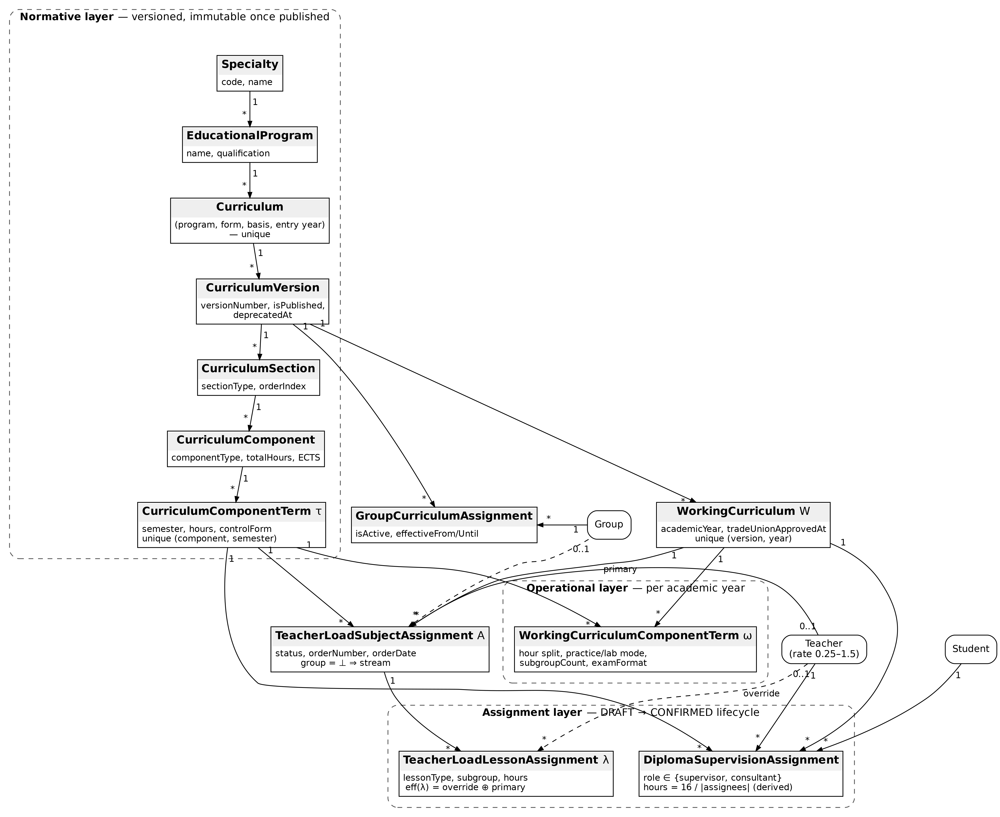
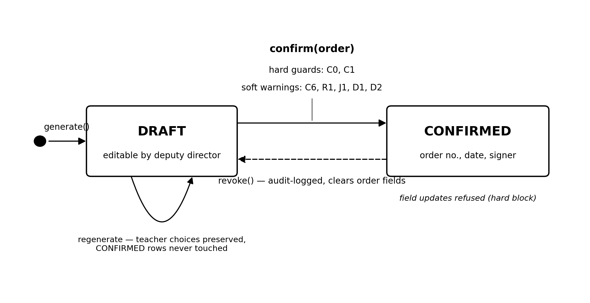
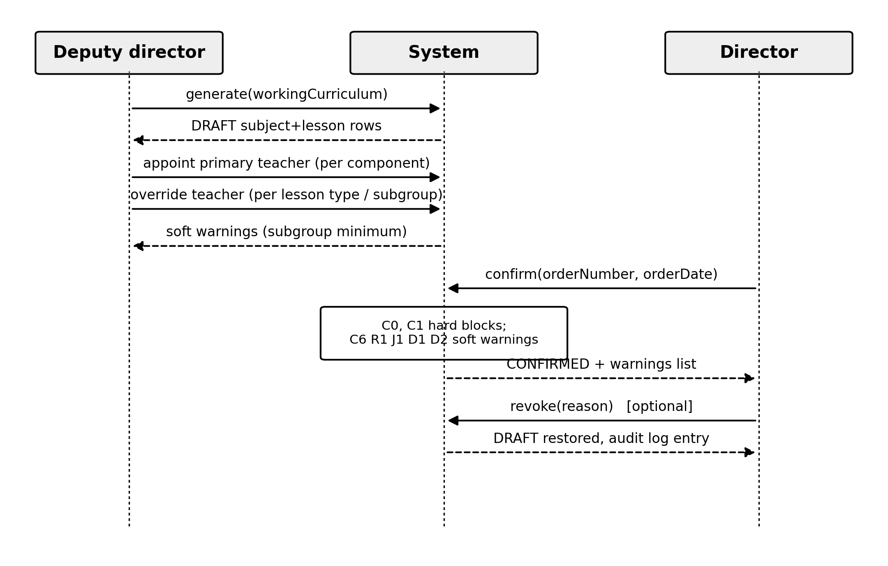
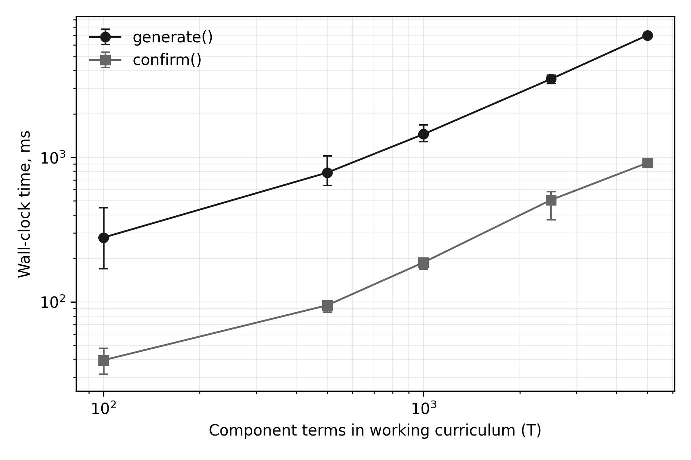

# Versioned Curriculum Data Model and Algorithms for Teaching Load Automation in Colleges

*Manuscript prepared for submission to the Journal of Edge Computing (ACNS). Anonymized for double-blind review: author names, affiliations, and identifying acknowledgements have been removed.*

## Abstract

In vocational pre-higher education, annual teaching load is still distributed manually in spreadsheets, without statutory-limit validation or an auditable approval trail. This paper presents a data model and algorithms for automated teaching load formation in a vocational pre-higher education institution in Ukraine. The proposed model organizes the curriculum domain into a normative layer of immutable, versioned curricula and an operational layer of annual working curricula from which draft load assignments are generated algorithmically. A two-stage confirmation workflow separates load preparation (deputy director) from formal approval by an institutional order (director) and enforces the statutory 720-hours-per-rate limit as a hard constraint, alongside soft advisory warnings. Normative formulas were verified by 800 000 randomized property checks (zero violations), and the production code scales linearly, generating realistic plans in under a second. The approach is recommended as a reusable reference for institutions digitalizing academic administration; future work covers load-balancing optimization and integration with timetabling.

**Keywords:** curriculum versioning; teaching load automation; educational information systems; workflow management; role-based access control; vocational pre-higher education

## 1. Introduction

The formation of the annual teaching (pedagogical) load is one of the most consequential administrative processes in any educational institution: it determines who teaches what, fixes the workload and, indirectly, the remuneration of every teacher, and must comply with statutory norms. In Ukrainian vocational pre-higher education, the process is regulated by the Law of Ukraine No. 2745-VIII "On Vocational Pre-Higher Education", whose Article 60 caps the annual teaching load at 720 hours per full-time position [1], and by Order No. 686 of the Ministry of Education and Science of 18 June 2021, which prescribes time norms for every category of teaching work, from lectures to examination and thesis supervision [2], as amended by Order No. 472 of 24 May 2022 [3].

Despite this dense normative framing, in most colleges the process remains manual. Deputy directors extract discipline hours from curriculum documents, distribute them across teachers in spreadsheets, check the 720-hour limit by hand, and prepare a paper order for the director's signature. The practice is error-prone in three specific ways. First, hour totals are re-derived from curriculum documents each year, so transcription errors accumulate precisely where the legal norms are strictest. Second, the statutory limit is verified after distribution rather than enforced during it, and violations are frequently discovered only after the order has been signed. Third, the spreadsheet medium retains no versioned history: when a curriculum is corrected mid-cycle, it is generally impossible to establish which version of the plan a given load distribution was derived from.

The academic literature approaches educational resource allocation predominantly from the optimization side. The university course timetabling problem and its variants have been surveyed extensively [4, 5], and recent work extends the models to hybrid teaching settings [6]. This line of research, however, presumes that the input to the scheduler — which teacher is assigned to which course for how many hours — is already known and valid. The upstream problem of *forming* that assignment from curriculum documents under statutory constraints has received far less attention. Work on teaching management informatization in vocational colleges [7] and on enterprise resource planning systems in higher education [8] treats load distribution as one feature among many and does not describe the underlying data model or the constraint semantics in reproducible detail. Similarly, role-based access control (RBAC) has a mature general theory [9, 10] and has been applied to educational platforms [11], but published designs rarely connect the role model to a legally meaningful separation of duties in an approval workflow. Studies of integrated quality-management systems in education [12] and of the digital transformation of Ukrainian higher education [13, 14] document the institutional demand for such systems without providing transferable technical designs. Recent field evidence on education management information systems likewise reports a persistent utilization gap between the data such systems collect and the institutional decisions they are meant to support [32]. Established results in business process management [15] and in temporal database design [16] offer the general instruments — explicit workflow states and non-destructive versioning — but their application to curriculum-driven load formation has not, to our knowledge, been described.

This paper addresses that gap; its four contributions are stated in Section 1.1. In brief, they are: (i) a layered data model for the curriculum domain in which published curriculum versions are immutable and all operational planning is derived from them; (ii) an algorithm that generates draft teaching load assignments directly from an annual working curriculum, computing normed hours for twelve categories of teaching work according to Order No. 686; (iii) a confirmation workflow with an explicit distinction between hard (blocking) and soft (advisory) constraints, including the 720 × rate annual limit as a hard constraint; and (iv) a role model that encodes the statutory separation between load preparation and order-based approval. All four elements are described as implemented and verified in a production system operated by a vocational pre-higher education institution in Ukraine; the description therefore reflects executable semantics rather than a paper design.

The practical significance is twofold. For institutions of the same type — Ukraine alone has several hundred colleges subject to the same two normative acts — the model is directly reusable. For the broader educational-informatics community, the paper offers a documented case of translating a national normative act into machine-checked constraints, a pattern applicable wherever teaching load is regulated by law.

The relevance to edge computing lies in the deployment model rather than in the workload. The system runs entirely on institutional infrastructure — an on-premises application server with co-located PostgreSQL and Redis instances — rather than in a centralized cloud, a configuration typical for state-funded colleges with constrained budgets and, in present-day Ukraine, intermittent connectivity and power. Its only external dependency, the national EDBO registry, is consumed asynchronously: a scheduled daily job pulls incremental changes using a persisted cursor with a deliberate overlap window, advanced only after a fully successful pass. The institutional node is therefore the authority for all planning data, and every core function described in this paper — curriculum versioning, load generation, order confirmation — remains fully operational while the link to the central registry is degraded or absent, with reconciliation deferred until connectivity returns. The paper can thus also be read as a case study in applying edge-computing deployment principles — local autonomy, local data authority, and tolerance of intermittent central connectivity, as articulated for local-first software [26] and studied in educational edge deployments [17, 18, 31] — to institutional administrative software rather than to sensor-centric workloads.

### 1.1. Novelty of this work

The novelty of this study, relative to the literature reviewed above, comprises four elements.

**(i) First formalized model of versioned curricula for vocational pre-higher education.** Prior work on teaching management informatization in vocational colleges [7] and on ERP adoption in higher education [8] treats curricula as configuration data; no published design, to our knowledge, formalizes the curriculum of a vocational pre-higher education institution as a hierarchy of immutable, versioned normative documents from which all operational planning is derived, with append-only supersession in the spirit of temporal database practice [16].

**(ii) A draft-generation algorithm with proven idempotence with respect to teacher appointments.** The projection from a working curriculum to draft assignments is deterministic and, crucially, preserves human appointment decisions across arbitrary regenerations. We state this idempotence property explicitly and verify it against the implementation and its test suite, treating it as a checkable specification in the tradition of lightweight formal methods [19, 21] and property-based testing [23, 24].

**(iii) The statutory limit as a transactional invariant.** The 720 × rate annual cap of Article 60 of Law No. 2745-VIII [1] is enforced not as a report but as an invariant of the confirmation transaction, aggregated per effective teacher across all working curricula of the academic year; violation aborts the transition atomically.

**(iv) An evaluation methodology including offline-autonomy testing.** The evaluation combines code-level verification of constraint semantics with an edge-oriented measurement design — offline-autonomy scenarios in which the link to the national registry is severed — reported with bootstrap confidence intervals [33], following current benchmarking practice for edge deployments [29, 30].

---

### 1.2. Comparison with existing systems

**Table 1.** Feature comparison of representative student/academic management systems against the requirements of statutory teaching load formation. "n/r" = not reported in publicly available vendor documentation or literature; absence of a report is not evidence of absence.

| System | Curriculum versioning with immutability | Statutory load-limit validation | Separation-of-duties confirmation workflow | Offline-first local authority | Open architecture |
|---|---|---|---|---|---|
| Ellucian Banner Student (+ Faculty Load and Compensation) | term-effective catalog records; immutability of published versions n/r | institution-defined workload rules and load analysis reports; no statutory-limit semantics reported | n/r (compensation review via self-service; order-based approval n/r) | on-premises deployment supported; offline-first operation n/r | proprietary |
| SAP Student Lifecycle Management (SLcM) | academic structure with program and module catalogs; version immutability n/r | n/r | generic role-based authorizations; legally framed duty separation n/r | on-premises deployment supported; offline-first operation n/r | proprietary |
| openSIS (OS4ED) | n/r (course manager without versioned curricula) | n/r | basic role permissions; confirmation workflow n/r | self-hosted; institution holds its data | open source (community edition) |
| Fedena | n/r (courses/batches model; no versioned curricula reported) | n/r | role-based logins; confirmation workflow n/r | self-hosted deployment possible | community edition open source (Apache 2.0) |
| «Деканат» (Politek-SOFT), Ukraine | curriculum ("навчальний план") data maintained; version immutability n/r | planned teacher load formation and departmental distribution; statutory 720-hour validation n/r | n/r | institution-local (client–server) deployment | proprietary |
| АСУ «ВНЗ» (АС «Деканат», ІВС «Освіта»), Ukraine | curriculum module present; version immutability n/r | teacher load module present; statutory-limit enforcement n/r | n/r | institution-local deployment | proprietary |
| EDEBO (national registry) | not applicable — registry of records, not an EMIS | not applicable | not applicable | central service; requires connectivity | closed national infrastructure |
| **This work** | **immutable published versions; append-only supersession** | **720 × rate as hard transactional block (Art. 60 [1])** | **preparer (deputy director) ≠ approver (director); order-based, audited** | **institutional node is data authority; core functions operate offline** | **documented model and algorithms (reference design)** |

Two observations follow from the comparison. First, the international platforms — Ellucian Banner and SAP SLcM — are mature in catalog management and workload *accounting*: Banner's Faculty Load and Compensation module extracts faculty assignments, applies institution-defined workload and compensation rules, and produces contract and term load analyses, while SLcM organizes programs and modules into a bookable academic structure. Neither, however, documents the two properties this paper argues are central for a statutory regime: immutability of published curriculum versions as a guarantee (rather than a convention), and a load-limit check whose semantics derive from a national legal act and whose violation blocks a legally meaningful transition. Their workload rules are institutional parameters, not transactional invariants with legal force. Second, the open-source school systems (openSIS, Fedena) and the Ukrainian institutional packages («Деканат» by Politek-SOFT, deployed across Ukrainian institutions since the late 1990s, and АСУ «ВНЗ» of the «Освіта» information system family) do cover curricula and planned teacher load as data-management features, and the Ukrainian systems in particular are deployed on institutional infrastructure — an implicit form of local authority. But available documentation reports no versioned immutability, no statutory-limit enforcement at confirmation time, and no legally framed separation between the person who prepares a distribution and the person who enacts it by order. EDEBO, finally, is deliberately excluded from feature scoring: it is the national registry of record, not an institutional management system, and the architecture described in this paper treats it as an upstream synchronization source. The gap the present work fills is therefore not the existence of load modules, which are common, but the combination of immutable normative provenance, statutory constraints as transactional invariants, and duty-separated confirmation in a locally autonomous deployment.

---

The remainder of the paper follows the IMRaD structure: Section 2 describes the system context, the design method, and the evaluation approach; Section 3 presents the data model, its formalization and algorithms, the confirmation workflow, and the experimental evaluation, and discusses significance and limitations; Section 4 outlines practical applications; Section 5 concludes and states future directions.

## 2. Methods

### 2.1. System context and participants

The study is based on the academic-administration information system of a state vocational pre-higher education institution (applied college) in Ukraine. The system manages students, teachers, academic groups, curricula, elective courses, grading, and teaching load. Reference data on students and teaching staff are synchronized daily and incrementally from the Unified State Electronic Database on Education (EDEBO), the national registry of education in Ukraine; the synchronization compares per-record modification timestamps against a persisted synchronization state and never overwrites attributes maintained locally. This provenance matters for load formation: group composition and teacher employment rates used by the algorithms originate from the national registry rather than from manual entry.

Participants are modelled by seven roles: student, teacher, schedule dispatcher, head of department, deputy director, director, and administrator. Three of these participate directly in load formation. The deputy director prepares the distribution: generates draft assignments, appoints teachers, and adjusts distribution modes. The director approves the distribution by an institutional order, or revokes a previously issued order. The administrator is a technical superuser whose interventions in the approval step are permitted but explicitly flagged (Section 3.5). Teachers have read access to their own computed load. Access is enforced server-side by declarative role guards on each endpoint; the default policy for the load-management module grants access only to the deputy director, director, and administrator roles, with individual endpoints widening (teacher self-view) or narrowing (confirmation, revocation) the set.

### 2.2. Data model design approach

The data model was designed by domain analysis of three source-document classes: the formal curriculum ("navchalnyi plan") approved for a specialty and admission cohort, the annual working curriculum derived from it, and the load-distribution order. Two design principles were fixed a priori. The first is *immutability of published normative documents*: once a curriculum version is published, its structure — sections, components, per-semester hour and credit distributions — must not change; corrections are made by creating and publishing a new version, and superseded versions are marked deprecated rather than deleted. This mirrors the append-only treatment of legally significant data in temporal database practice [16]. The second is *separation of the normative and operational layers*: annual planning artifacts reference the published version they are derived from but store their own operational attributes (per-lesson-type hour breakdowns, teacher appointments, subgroup splits), so that no operational edit can retroactively alter the normative record.

The model was implemented as a relational schema (PostgreSQL 17) managed through the Prisma object-relational mapper within a NestJS backend, with Redis used for session storage; the client is a Next.js/React application communicating through a typed HTTP API. The technology stack is reported for reproducibility only and is not a contribution of this paper.

### 2.3. Algorithm and workflow design

The load-formation algorithm was designed as a deterministic projection from the operational layer to a set of draft assignments, followed by human decisions (teacher appointment) and a formal confirmation step. Hour computation for each category of teaching work implements the norms of Order No. 686 directly: each norm paragraph was translated into a pure function with the norm constant declared once in a dedicated constants module, annotated with the paragraph of the order it implements. The confirmation workflow was designed as a two-state machine (draft, confirmed) with an explicit taxonomy of validation rules: *hard blocks*, which abort the confirmation transaction, and *soft warnings*, which are returned to the user but do not prevent the transition. The classification criterion is legal force: rules that restate a binding statutory limit are hard; rules that restate recommendations, procedural good practice, or timing expectations are soft.

### 2.4. Evaluation approach

The claims made in Section 3 about system behaviour were validated against the production codebase rather than against design documentation, in three steps. First, the constraint logic of the confirmation step was traced through the source of the assignment service to confirm the exact set of hard and soft rules and their evaluation order. Second, the normed-hour formulas were checked against their unit test suite, which exercises each formula (semester control hours for oral and written examinations, control-work checking, practice supervision, course-work supervision, thesis supervision pools) with boundary inputs. Third, the 720 × rate rule was verified to aggregate hours per *effective* teacher — the override teacher of a lesson if present, otherwise the primary teacher of the subject — across *all* working curricula of the same academic year, including individually assigned thesis-supervision hours that live outside the draft/confirmed workflow. Where behaviour observed in code differed from informal documentation, the code was taken as authoritative; the description below reflects the implemented semantics.

Beyond code inspection, three quantitative instruments were used. First, the normative-hour formulas were subjected to randomized property-based testing [23, 24, 25]: eight algebraic properties derived from Order No. 686 — exactness at the four statutory rate points, monotonicity in student and group counts, linearity of control-work checking, conservation of the per-student thesis pool, and guard-clause behaviour — were each evaluated on 10^5 random inputs, executed against the compiled production build of the formula module. Second, the scalability of generation and confirmation was measured end-to-end on the unmodified production service code against a local PostgreSQL 17 instance seeded with synthetic working curricula of 100–5 000 component terms and 5–20 groups; each point is reported as a mean over repeated runs with 95% bootstrap confidence intervals [33] (10^4 resamples), following benchmarking practice for resource-constrained edge environments [29, 30]. Third, an outage-tolerance protocol was designed for the production deployment: the registry link is severed for 1–30 days by rewinding the persisted synchronization cursor, the core functions are exercised, and reconciliation time is measured after reconnection; together with an anonymized analysis of confirmed production loads, this instrument is fully specified in the accompanying materials, and its execution on the live deployment is reported as pending rather than simulated. Keeping the formal statements of Section 3.6 in conformance with the evolving implementation is, in turn, a use case for model-based trace checking [22].

## 3. Results and Discussion

### 3.1. The versioned curriculum data model

The normative layer forms a five-level hierarchy. A *Specialty* (licensed unit, e.g. a national specialty code) owns *Educational Programs*; a program owns *Curricula*, where a curriculum is a container uniquely identified by the tuple (program, education form, admission basis, entry year) — education form being full-time, part-time, or dual, and admission basis distinguishing enrolment after the 9th or the 11th school grade. A curriculum owns numbered *Curriculum Versions*. A version owns ordered *Sections* (typed blocks such as general secondary education, general and professional competencies, elective part, practical training, attestation); sections own *Components* (disciplines, practices, course works and projects, thesis-related components), and each component owns per-semester *Component Terms* carrying the ECTS credits, total hours, weekly hours, the form of final control (examination, credit, graded credit), course-work flags, and the subgroup count with an optional textual justification for splitting. Versions additionally own a time-budget table and an academic calendar (week-by-week typing of instruction, examination sessions, practice, and holidays), which serve as verification totals for the structure.

Immutability is enforced at the service boundary: every mutation endpoint for sections, components, and terms first asserts that the target version is unpublished and raises an error otherwise. Publication stamps the version with a publication timestamp; retiring a version sets a deprecation timestamp without deleting anything. A correction to a published plan therefore always produces a new version number under the same curriculum, and every downstream artifact records which version it was derived from. Academic groups are bound to versions through dated assignment records that are closed rather than deleted when a group migrates, preserving the full binding history.

The operational layer is anchored by the *Working Curriculum*: exactly one per (published version, academic year), carrying the semester numbers taught that year and the approval metadata required by the governing law — the date and protocol number of the pedagogical council meeting and of the trade-union committee agreement. Each working curriculum owns *Working Component Terms* that decompose the normative term hours into lecture, practical, laboratory, seminar, independent-study, and consultation hours; declare the distribution mode of practical and laboratory classes (stream-wide or per group); fix the examination format (oral or written) where the control form is an examination; and record counts used by the norms (control works, practice duration in weeks, thesis committee size).

The assignment layer consists of two entities. A *Subject Assignment* is one record per (working curriculum, component term, group), where a null group denotes stream-level teaching (lectures are always stream-level); it carries the academic year, the *primary teacher*, the identity of the user who generated it, the workflow status (draft or confirmed), and — once confirmed — the order number, order date, and the identity of the signing user. A subject assignment owns *Lesson Assignments*, one per category of teaching work and, where subgroups apply, per subgroup, each carrying the normed hours and an optional *override teacher*. The effective teacher of a lesson is computed, never stored: it is the override teacher if set, otherwise the primary teacher of the parent subject assignment. This two-level scheme captures the dominant practical case — one teacher responsible for a discipline — in a single attribute, while permitting per-lesson-type exceptions (e.g. a different teacher for laboratory sessions) without duplicating the assignment. Thesis supervision is modelled separately as a student-to-teacher relation, because different students in one group have different supervisors; its hours are computed on demand by dividing the per-student pool among the appointed supervisors and consultants, so that changes in supervision teams never leave stale totals. Figure 1 summarizes the three layers and their relations.

{ width=100% }

*Figure 1. The three-layer data model: normative (versioned, immutable once published), operational (per academic year), and assignment (draft/confirmed lifecycle). Solid arrows denote 1–N ownership; dashed arrows denote optional teacher references.*

### 3.2. Formal model and normative-hour equations

The subsystem is organised in three layers: a *normative* layer (approved curricula), an *operational* layer (year-specific working plans), and an *assignment* layer (teacher–load records governed by a draft/confirmed lifecycle). We formalise each layer as sets and tuples that mirror the relational schema.

**Normative layer.** Let $S$ be the set of specialties and $P$ the set of educational programmes, with a total function $\mathrm{spec}: P \to S$. A *curriculum* is a tuple

$$C = (p, f, b, y), \qquad p \in P,$$

where $f$ is the form of education, $b$ the admission basis, and $y \in \mathbb{N}$ the entry year; the quadruple is unique (enforced by a composite uniqueness constraint on the corresponding relation). A curriculum owns a totally ordered set of *versions* $V(C) = \{v_1, v_2, \dots\}$, each $v = (C, n, \pi, \delta)$ with version number $n$, publication flag $\pi \in \{0,1\}$ and deprecation timestamp $\delta \in \mathbb{T} \cup \{\bot\}$. A published version ($\pi = 1$) is immutable (Section 5, Invariant I2). A version contains ordered *sections* $\Sigma(v)$, each section contains ordered *components* $K(\sigma)$ (disciplines, practices, attestation items), and each component $\kappa$ is distributed over semesters by *terms*: a term $\tau = (\kappa, m, e, h, c, \omega_{\mathrm{cw}}, \omega_{\mathrm{cp}}, \sigma_\tau)$ carries the semester number $m$, ECTS credits $e$, hours $h$, the final-control form $c \in \{\mathrm{EXAM}, \mathrm{CREDIT}, \mathrm{GRADED\_CREDIT}, \bot\}$, course-work / course-project flags, and a default subgroup count $\sigma_\tau \geq 1$. The pair $(\kappa, m)$ is unique.

**Operational layer.** For a published version $v$ and an academic year $Y$ (e.g. "2024–2025") there is at most one *working curriculum* $W = (v, Y)$. It refines each normative term $\tau$ into a *working term* $\omega = (W, \tau, \vec{h}, \mu_p, \mu_\ell, \sigma, \phi, a, i, w, k)$, where $\vec{h} = (h_{\mathrm{lec}}, h_{\mathrm{pr}}, h_{\mathrm{lab}}, h_{\mathrm{sem}}, h_{\mathrm{ind}}, h_{\mathrm{cons}})$ is the per-kind hour split, $\mu_p, \mu_\ell \in \{\mathrm{STREAM}, \mathrm{PER\_GROUP}\}$ are the distribution modes for practical and laboratory classes, $\sigma \geq 1$ the subgroup count, $\phi \in \{\mathrm{ORAL}, \mathrm{WRITTEN}, \bot\}$ the exam format, $a, i \in \mathbb{N}$ the counts of in-class and independent control works, $w$ the practice duration in weeks, and $k$ the diploma-committee size (default 3). Academic groups are bound to versions by an active-binding relation $B \subseteq G \times V$; we write $G(v) = \{g : (g,v) \in B,\ \text{binding active}\}$ and $n_s(g)$ for the number of active students of group $g$.

**Assignment layer.** A *subject assignment* is a tuple

$$A = (W, \tau, g, t_p, s, \nu, d, u_a, u_d), \qquad g \in G(v) \cup \{\bot\},$$

where $g = \bot$ denotes a *stream* assignment (shared by all groups of the version), $t_p$ is the primary teacher (possibly $\bot$ while drafting), $s \in \{\mathrm{DRAFT}, \mathrm{CONFIRMED}\}$ the lifecycle status, $\nu, d$ the order number and order date (set only when confirmed), and $u_a, u_d$ the acting deputy and the signing director. Each subject assignment owns *lesson assignments* $\Lambda(A)$: a lesson $\lambda = (A, \chi, j, h, t_o)$ carries the lesson kind $\chi$ (lecture, practice, lab, seminar, consultation, supervised independent work, semester control, control-works checking, practice supervision, course-work supervision, diploma committee seat, pre-control consultation), an optional subgroup number $j \in \{1..\sigma\} \cup \{\bot\}$, an integer hour volume $h$, and an optional *override teacher* $t_o$. The teacher who actually carries the hours of a lesson is

$$\mathrm{eff}(\lambda) \;=\; \begin{cases} t_o(\lambda), & t_o(\lambda) \neq \bot,\\[2pt] t_p(A(\lambda)), & \text{otherwise.} \end{cases} \qquad (1)$$

Personal diploma supervision is deliberately kept outside this group-centric structure: a relation $D \subseteq \mathrm{Student} \times \tau \times \mathrm{Teacher} \times \{\mathrm{SUPERVISOR}, \mathrm{CONSULTANT}\}$ records who supervises or consults each student's thesis; the triple (student, term, teacher) is unique, and supervision hours are never stored — they are recomputed from $|D|$ on demand (Eq. 6), so they cannot become stale when the supervisor set changes.

The following equations are implemented as pure functions and verified by unit tests; all constants derive from the national workload norms for professional pre-higher education. Let $n_g$ denote the number of groups taking a control event and $n_s$ the corresponding student count.

**Semester control** (credit vs. examination):

$$H_{\mathrm{ctl}}(c, \phi, n_g, n_s) \;=\; \begin{cases} 2\,n_g, & c \in \{\mathrm{CREDIT}, \mathrm{GRADED\_CREDIT}\},\\ 0.33\,n_s, & c = \mathrm{EXAM},\ \phi = \mathrm{ORAL},\\ 3\,n_g + 0.5\,n_s, & c = \mathrm{EXAM},\ \phi = \mathrm{WRITTEN},\\ 0, & \text{otherwise (incl. } c = \mathrm{EXAM}, \phi = \bot\text{).} \end{cases} \qquad (2)$$

**Checking of control (module) works**, where $a$ works are written in class and $i$ during independent study, one script per student:

$$H_{\mathrm{cw}}(a, i, n_s) \;=\; 0.25\,a\,n_s \;+\; 0.33\,i\,n_s. \qquad (3)$$

**Practice supervision** for a practice component lasting $w > 0$ weeks:

$$H_{\mathrm{pr}} \;=\; \begin{cases} 18\,w\,\max(\sigma', 1), & \text{educational practice},\\ 1 \cdot w\,n_s, & \text{technological / pre-graduation practice},\\ 0, & \text{otherwise}, \end{cases} \qquad (4)$$

where $\sigma'$ is the subgroup multiplier of the pure function ($\sigma' \geq 2$ multiplies the weekly norm, each subgroup being led separately at the full rate). In the generation service the function is invoked with $\sigma' = 1$ and the multiplication is realised structurally instead: one lesson row per subgroup, each carrying the full $18w$ (see Algorithm 1, step 5.5). Production-type practice is *not* multiplied by subgroups — $n_s$ already fixes the total volume regardless of how many supervisors share the students.

**Course work and course project supervision** (per student; both norms add if a term unusually has both):

$$H_{\mathrm{cwk}} \;=\; 3\,n_s\,[\omega_{\mathrm{cw}}] \;+\; r\,n_s\,[\omega_{\mathrm{cp}}], \qquad r = \begin{cases} 3, & \text{general-competency section},\\ 4, & \text{professional section}. \end{cases} \qquad (5)$$

**Diploma supervision and defence committee.** Each thesis carries a shared pool of 16 hours divided equally among all persons assigned to that student for that term (supervisor and consultants); each committee member additionally receives 0.5 h per defended student:

$$h_{\mathrm{dip}}(s, \tau) \;=\; \frac{16}{|\,\mathrm{assignees}(s, \tau)\,|}, \qquad H_{\mathrm{com}} \;=\; 0.5\,n_s \ \text{per committee seat}. \qquad (6)$$

**Pre-control consultation**, 2 h per group before any credit or examination:

$$H_{\mathrm{pcc}}(c, n_g) \;=\; \begin{cases} 2\,n_g, & c \neq \bot,\\ 0, & c = \bot. \end{cases} \qquad (7)$$

**Annual limit.** A teacher $t$ employed at rate $\rho(t) \in [0.25, 1.5]$ may carry at most

$$L(t) \;=\; \mathrm{round}\bigl(720 \cdot \rho(t)\bigr) \ \text{hours per academic year.} \qquad (8)$$

At materialisation time every computed volume from Eqs. (2)–(7) is rounded to the nearest integer, because lesson rows store integer hours for the signed order document; fractional norms (0.25/0.33/0.5) therefore only round once, at the group level.

### 3.3. Algorithms, complexity, and idempotence

**Algorithm 1 — GenerateDraftAssignments.**
*Input:* working curriculum $W$, acting user $u$. *Output:* fresh DRAFT assignment set for $W$; CONFIRMED records are never modified.

1. Load $W$ with its working terms $\Omega(W)$ ordered by (section order, component order, semester number).
2. $G \leftarrow G(v(W))$ (groups actively bound to the version); for each $g \in G$ compute $n_s(g)$ over active students.
3. **Snapshot of prior appointments.** For every existing DRAFT subject assignment $A$ of $W$ with key $k_A = (\tau(A), \mathrm{scope}(A))$, where scope is the group or the marker "stream": store $P[k_A] \leftarrow t_p(A)$; for every lesson $\lambda \in \Lambda(A)$ with $t_o(\lambda) \neq \bot$ store $O[k_A, \chi(\lambda), j(\lambda)] \leftarrow t_o(\lambda)$.
4. Initialise output buffers $R_{\mathrm{subj}} \leftarrow \varnothing$, $R_{\mathrm{les}} \leftarrow \varnothing$. Define the helper $\mathrm{EmitLessons}(A, \chi, h, \sigma)$: if $\sigma \geq 2$, append one lesson row per subgroup $j \in \{1..\sigma\}$, each with the *full* hours $h$ and override $O[k_A, \chi, j]$ if present; otherwise append a single row with $j = \bot$ and override $O[k_A, \chi, \bot]$.
5. For each working term $\omega \in \Omega(W)$ with normative term $\tau$ and subgroup count $\sigma$:
   1. **Lectures (stream).** If $h_{\mathrm{lec}} > 0$: emit a stream subject ($g = \bot$, primary $\leftarrow P[(\tau, \mathrm{stream})]$ or $\bot$, status DRAFT); $\mathrm{EmitLessons}(\cdot, \mathrm{LECTURE}, h_{\mathrm{lec}}, \sigma)$.
   2. **Other stream kinds.** Collect (seminar, consultation, independent-work) hours, plus practice hours if $\mu_p = \mathrm{STREAM}$ and lab hours if $\mu_\ell = \mathrm{STREAM}$; if any are positive, emit one stream subject and $\mathrm{EmitLessons}$ for each positive kind.
   3. **Per-group practice/lab.** If $\mu_p = \mathrm{PER\_GROUP}$ and $h_{\mathrm{pr}} > 0$, or $\mu_\ell = \mathrm{PER\_GROUP}$ and $h_{\mathrm{lab}} > 0$: for each $g \in G$ emit a subject with scope $g$ and $\mathrm{EmitLessons}$ for those kinds (full hours per group, enabling distinct teachers).
   4. **Control events (per group, no subgroup split).** For each $g \in G$: $h_1 \leftarrow \mathrm{round}(H_{\mathrm{ctl}}(c_\tau, \phi, 1, n_s(g)))$ (Eq. 2), $h_2 \leftarrow \mathrm{round}(H_{\mathrm{cw}}(a, i, n_s(g)))$ (Eq. 3), $h_3 \leftarrow \mathrm{round}(H_{\mathrm{pcc}}(c_\tau, 1))$ (Eq. 7); if $h_1 + h_2 + h_3 > 0$ emit a subject for $g$ with one lesson row per positive volume.
   5. **Practice supervision.** If the component is a practice: for each $g \in G$ compute $h \leftarrow \mathrm{round}(H_{\mathrm{pr}})$ (Eq. 4 with $\sigma' = 1$); if $h > 0$ emit a subject for $g$ and $\mathrm{EmitLessons}(\cdot, \mathrm{PRACTICE\_SUPERVISION}, h, \sigma)$.
   6. **Course work / project.** If $\omega_{\mathrm{cw}} \lor \omega_{\mathrm{cp}}$: for each $g \in G$ compute $h \leftarrow \mathrm{round}(H_{\mathrm{cwk}})$ (Eq. 5); if $h > 0$ emit a subject with a single supervision row.
   7. **Defence committee.** If the component is a diploma project or qualification-work defence: for each $g \in G$ compute $h \leftarrow \mathrm{round}(0.5\, n_s(g))$ (Eq. 6); if $h > 0$ emit a subject and $\mathrm{EmitLessons}(\cdot, \mathrm{DIPLOMA\_COMMITTEE}, h, k)$ — the committee size $k$ plays the role of $\sigma$, producing one independently assignable *seat* row per member.
6. **Atomic replacement.** In a single transaction: delete all DRAFT subject assignments of $W$ (lesson rows cascade); bulk-insert $R_{\mathrm{subj}}$; bulk-insert $R_{\mathrm{les}}$.
7. Return the assignment list in document order.

**Algorithm 2 — ConfirmByOrder.**
*Input:* working curriculum $W$ (year $Y$), order number $\nu$, order date $d$, acting user $u$. *Output:* number of confirmed records and a warning list $\Phi$.

1. If $\mathrm{DRAFT}(W) = \varnothing$: **reject** (nothing to confirm).
2. **C0 (hard).** If $\exists A \in \mathrm{DRAFT}(W): t_p(A) = \bot$: **reject**, reporting the count of unassigned components.
3. **C1 (hard).** $H \leftarrow \mathrm{AnnualHours}(Y)$ (Algorithm 3). If $\exists t: H(t) > L(t)$ (Eq. 8): **reject**, listing each offending teacher with $H(t)$ and $L(t)$.
4. $\Phi \leftarrow \varnothing$; append soft warnings:
   1. **C6** — $u$ holds the administrator role rather than the director role (the order is legally the director's act);
   2. **R1** — $d$ is later than 1 September of the start of $Y$;
   3. **J1** — no trade-union approval is recorded on $W$;
   4. **D1** — some teacher appearing in $\mathrm{DRAFT}(W)$ is primary on more than 5 distinct disciplines across the academic year $Y$ (symmetric in scope with C1 and D2);
   5. **D2** — some teacher supervises more than 8 theses (role SUPERVISOR) in year $Y$.
5. **Atomic transition.** One bulk update: for all $A \in \mathrm{DRAFT}(W)$ set $s \leftarrow \mathrm{CONFIRMED}$, $\nu(A) \leftarrow \nu$, $d(A) \leftarrow d$, $u_d(A) \leftarrow u$; where a term's confirmed teacher is unambiguous, it is also propagated to the operational layer's per-term teacher attribute, keeping the two references consistent. Steps 2–5 execute inside one serialisable transaction; a serialisation conflict rejects the confirmation with a retryable error.
6. Return $(|\mathrm{DRAFT}(W)|, \Phi)$.

**Algorithm 3 — AnnualHours($Y$).**

1. $\Lambda_Y \leftarrow$ all lesson rows whose parent subject assignment has academic year $Y$ — *across every working curriculum of the year and irrespective of status*.
2. $H \leftarrow$ empty map. For each $\lambda \in \Lambda_Y$: $t \leftarrow \mathrm{eff}(\lambda)$ (Eq. 1); if $t \neq \bot$ then $H(t) \mathrel{+}= h(\lambda)$.
3. For every teacher having diploma assignments in $Y$ (queried without a pre-filtered teacher list, so that a teacher whose *only* load is thesis supervision is still covered): for each assignment $(s, \tau)$ add $h_{\mathrm{dip}}(s, \tau)$ (Eq. 6) to $H(t)$.
4. Return $H$.

Let $T = |\Omega(W)|$ be the number of working terms, $G = |G(v)|$ the number of bound groups, $\sigma$ the maximal subgroup/committee width (bounded by a small constant, $\sigma \leq \max(2, k)$), and $K$ the constant number of lesson kinds. Step 5 of Algorithm 1 performs, per term, $O(K\sigma)$ work for the stream subjects and $O(G\sigma)$ work for each of the per-group families (5.3–5.7), hence

$$T_{\mathrm{gen}} \;=\; O\bigl(T \cdot (K + G)\,\sigma\bigr) \;=\; O(T \cdot (G + K)),$$

since $\sigma = O(1)$. The number of materialised lesson rows is $|\Lambda| = O(T\,G\,\sigma)$, which also bounds the memory footprint together with the snapshot maps $P, O$ (proportional to the previous draft size). Database traffic is a constant number of set-oriented queries plus one three-statement transaction — no per-row round-trips. Confirmation is dominated by the year-wide limit check: $T_{\mathrm{conf}} = O(|\Lambda_Y| + |\mathrm{DRAFT}(W)| + |D_Y|)$, i.e. linear in the lesson rows of the academic year; the aggregation in Algorithm 3 is a single pass with $O(1)$ map updates per row.

**Idempotence of generation with respect to teacher appointments.** Define the *key* of a subject row as $(\tau, \mathrm{scope})$ and of a lesson row as $(\tau, \mathrm{scope}, \chi, j)$. For a fixed working-plan configuration and group population, Algorithm 1 is a deterministic function of its inputs: the set of emitted keys and their hour volumes depend only on $\Omega(W)$, the modes $\mu_p, \mu_\ell$, $\sigma$, and the counts $n_s(g)$. Repeating the algorithm therefore reproduces exactly the same keyed structure (up to freshly minted surrogate identifiers).

Appointment preservation follows from the snapshot maps. Before deletion, step 3 records $t_p$ under every subject key and $t_o$ under every lesson key at which an override exists. During emission, each newly created row looks up *its own key* in $P$ (resp. $O$) and restores the stored teacher, defaulting to $\bot$. Since regeneration under unchanged inputs emits the same key set, every previously stored appointment is looked up successfully and restored, and no key can receive a foreign appointment because keys are unique within a draft ($(\tau, \mathrm{scope})$ pairs are emitted at most once per family, and lesson keys extend subject keys injectively). Hence $\mathrm{Gen} \circ \mathrm{Gen} = \mathrm{Gen}$ on the observable state (keys, hours, appointments). When inputs *do* change — e.g. a distribution mode flips from STREAM to PER_GROUP — keys that disappear take their appointments with them, which is the intended semantics: an appointment is meaningful only relative to the structure it was made in. The delete-and-insert pair runs inside one transaction, so a concurrent reader never observes a half-replaced draft.

Four implementation notes qualify the algorithms. The educational-practice subgroup multiplier of Eq. (4) is realised structurally — one supervision row per subgroup at the full weekly norm — rather than arithmetically, which is what enables a distinct supervisor per subgroup. The committee norm of Eq. (6) is materialised per member *per student*, one independently assignable seat row per member. The advisory discipline-count rule D1 is evaluated year-wide, symmetrically with the hard limit C1 and the thesis rule D2. Finally, fractional norms are rounded to integer hours per group when lesson rows are created, because stored hours feed the printed order; the pure functions themselves remain exact.

### 3.4. Operational behaviour of draft generation

Draft generation is a single endpoint invoked by the deputy director for a working curriculum. The algorithm proceeds as follows. It loads all working component terms in curriculum order, the set of groups actively bound to the underlying version, and the per-group student counts (needed by norms expressed per student). It then snapshots all existing draft assignments to two dictionaries — primary teachers keyed by (term, group-or-stream) and override teachers keyed additionally by lesson type and subgroup — so that teacher decisions survive regeneration. For each term it emits: a stream-level subject with a lecture lesson, when lecture hours are positive; stream-level lessons for seminars, consultations, and institution-internal supervised independent work, which the governing norms always treat as stream-level; practical and laboratory lessons either on the stream subject or as separate per-group subjects, according to the declared distribution mode; and derived lessons whose volumes are computed from the normative equations (2)–(7). Where a term is split into subgroups, one lesson row is emitted per subgroup with the full hour value, since each subgroup is taught separately. Finally, the algorithm atomically replaces the previous draft set with the new one, restoring saved teacher decisions by key; confirmed records are never touched or regenerated. The whole generation is idempotent with respect to teacher appointments, which proved essential in practice: hour corrections in the working curriculum can be re-projected at any moment during the planning season without losing weeks of appointment work.

After generation, the deputy director appoints a primary teacher for every subject assignment and, where necessary, override teachers for individual lesson types or subgroups; the system clears an override automatically if it equals the primary teacher. Editing is refused for confirmed records, and switching a distribution mode regenerates only the drafts of the affected term, again refusing if confirmed records exist for it.

### 3.5. The confirmation workflow and the 720 × rate rule

Confirmation is a distinct endpoint restricted to the director and administrator roles and parameterized by the order number and order date. It validates, in order, two hard blocks and a series of soft warnings, as summarized in Table 2; Figure 2 shows the resulting state machine and Figure 3 the interaction flow between the participants.

**Table 2.** Validation rules of the confirmation step (as implemented).

| Rule | Kind | Content | Basis |
|---|---|---|---|
| C0 | hard block | every draft subject assignment has a primary teacher | procedural completeness |
| C1 | hard block | for every effective teacher, annual hours aggregated over every lesson row of the year — all working curricula, drafts and confirmed orders alike — plus thesis supervision, do not exceed round(720 × rate) | Art. 60, Law No. 2745-VIII |
| C6 | soft warning | confirmation performed by an administrator rather than the director | Art. 60, Law No. 2745-VIII |
| R1 | soft warning | order date is later than 1 September of the academic year | planning good practice |
| J1 | soft warning | no trade-union committee agreement recorded on the working curriculum | Art. 60(5), Law No. 2745-VIII |
| D1 | soft warning | a teacher is assigned more than 5 distinct disciplines across the academic year | Order No. 686 (recommended) |
| D2 | soft warning | a supervisor leads more than 8 theses | Order No. 686, para. 20 (recommended) |

*Note: the rule identifiers (C0, C1, C6, R1, J1, D1, D2) are the rule labels used in the implementation source code, reproduced here verbatim for traceability.*

{ width=95% }

*Figure 2. The assignment lifecycle. Regeneration replaces draft structure while preserving teacher appointments; confirmed rows are immutable except through the audited revocation edge.*

{ width=95% }

*Figure 3. Interaction flow: the deputy director prepares and staffs the draft; the director enacts it by order; the system enforces hard guards and reports soft warnings.*

The 720-hour rule deserves elaboration, as it is the legally binding core of the workflow. Each teacher record carries an employment rate between 0.25 and 1.5 synchronized from staff data, and the individual annual limit is computed as round(720 × rate) — 360 hours at half rate, 1080 at one-and-a-half. At confirmation time the system aggregates hours per effective teacher over every lesson assignment in every working curriculum of the same academic year, irrespective of status — not merely the plan being confirmed — and adds the dynamically computed thesis-supervision hours, which exist outside the draft/confirmed workflow. If any teacher exceeds the personal limit, the confirmation aborts with a diagnostic identifying the teacher and the excess; no partial confirmation occurs. The hard guards and the confirming write execute in one serialisable transaction, so a concurrent edit of the year's load yields a retryable conflict rather than a confirmation against a stale aggregate. This closes the classic spreadsheet failure mode in which each of several documents is individually valid but their union is not.

The soft-warning design reflects a deliberate boundary between law and judgement. The 1 September check (R1) illustrates it: the order *should* be issued before the academic year begins, but a later order is legally possible (e.g. after a staffing change), so the system warns rather than blocks. Similarly, confirmation by the administrator role is permitted for operational resilience but generates a persistent warning that the order legally requires the director's signature. Upon successful confirmation, all draft records of the working curriculum transition atomically to the confirmed state, acquiring the order number, order date, and signer identity. A separate revocation endpoint, restricted to the same two roles, returns all confirmed records of a working curriculum to draft, clears the order fields and signature, and writes an audit-log entry, so that a revoked order is a recorded event rather than a silent rollback.

### 3.6. Invariants

**I1 (Confirmation preserves the load limit).** *If ConfirmByOrder succeeds, then in the resulting state $\forall t: H(t) \leq L(t)$.*
*Proof.* $H$ is a function of the lesson rows' hours, override teachers, subject primary teachers, and the diploma-supervision relation (Algorithm 3). The confirming update (step 5) writes only the status, order number, order date, and signer fields — none of the inputs of $H$. Therefore $H^{\mathrm{post}} = H^{\mathrm{pre}}$, and $H^{\mathrm{pre}} \leq L$ pointwise is exactly what guard C1 verified before the write; a violation raises an exception and the update is never issued (check-before-write). The transition itself is a single set-oriented update statement and hence atomic: no observer sees a partially confirmed order. Two remarks sharpen the claim. First, C1 aggregates *all* lesson rows of the year, DRAFT and CONFIRMED alike, so confirming one working curriculum cannot push a teacher over the limit through hours hiding in another plan of the same year — including thesis-supervision hours, which live outside the lesson table but are added by Algorithm 3. Second, the guards and the update are enclosed in a single transaction executed at the serialisable isolation level: a concurrent load edit in the check-to-write window triggers a serialisation conflict, the persistence layer rejects one of the transactions, and the rejection is surfaced to the caller as a retryable conflict — the order is never confirmed against a stale aggregate. An earlier revision of the implementation lacked this enclosure; the gap was identified while stating this invariant and closed before publication. $\square$

**I2 (Published-version immutability ⇒ reproducibility of confirmed orders).** *Every confirmed order can be reproduced from the version it was generated against.*
*Proof.* Every structural mutation of the normative layer (create/update/delete of sections, components, terms, elective blocks, display projections, time-budget and calendar entries) passes through a single guard that rejects the operation whenever the owning version has $\pi = 1$; deletion of a published or deprecated version is likewise refused, as is deletion of any version referenced by group bindings or working curricula. Referential integrity closes the remaining gap: subject assignments reference terms with delete-restrict semantics, terms restrict to components, components to sections, and sections to versions, so no element on the path from a confirmed assignment to its version can be removed while the assignment exists. Consequently the normative structure reachable from a confirmed order is bit-identical to the structure at confirmation time. Volumes are additionally *materialised*: lesson rows store integer hours copied at generation, so the order document does not depend on later drift in the operational layer (student counts, working-term hour splits) — reproducing the printed order is a pure read of the confirmed rows joined to the frozen version. Corrections are expressed as new versions (structure duplication into a fresh draft), never as in-place edits. $\square$

**I3 (Revoke is the exact inverse of confirm on assignment state).** *For any working curriculum, applying revoke after confirm restores the pre-confirmation assignment state.*
*Proof.* Confirm modifies precisely four fields of each affected row: $s: \mathrm{DRAFT} \to \mathrm{CONFIRMED}$, $\nu: \bot \to \nu_0$, $d: \bot \to d_0$, $u_d: \bot \to u$. Revoke performs the pointwise inverse on all CONFIRMED rows of the plan — status back to DRAFT and the three order fields back to $\bot$ — and touches nothing else; primary teachers, overrides, hours, and the diploma relation are untouched by both operations. The composition is therefore the identity on assignment state (modulo bookkeeping timestamps). Revoke additionally requires at least one CONFIRMED row, and it executes the bulk reset *and* the creation of an audit record (actor, action, target plan, IP, revert count, stated reason) inside one transaction, so the legally significant reversal cannot occur unlogged, nor can a log entry exist for a reversal that did not complete. After revocation the rows are again editable and re-confirmable under a new order. $\square$

### 3.7. Experimental evaluation

All measured numbers below were obtained by executing the production build of the system — not a reimplementation — on a commodity virtualized x86 machine (four-core AMD Ryzen 5 3500U, 3.8 GiB RAM) with an embedded PostgreSQL 17.2 instance; disk synchronization was disabled, so timings reflect algorithmic and query cost rather than storage durability. The environment is deliberately modest: it approximates the institution-grade hardware on which systems of this class actually run [29, 30].

**Property-based verification of the norm formulas.** Eight properties over the six normative-hour functions and the limit function were evaluated on 10^5 random inputs each — 800 000 checks in total — with zero violations: the limit function is exact at the statutory points (180, 360, 720, and 1 080 hours at rates 0.25, 0.5, 1.0, and 1.5) and monotone in the rate; semester-control hours are non-negative and monotone in group and student counts; control-work checking is linear in the student count; the per-student thesis pool of Eq. (6) is conserved (per-assignee hours times assignee count equals 16 for any team size); and the guard clauses of Eqs. (4) and (7) return zero outside their domains. Microbenchmarks place every formula at 4–28 ns per invocation (means over ten runs of 10^6 iterations), so norm evaluation is never a bottleneck.

**Scalability of generation and confirmation.** Table 3 and Figure 4 report wall-clock times of Algorithm 1 (generate) and Algorithm 2 (confirm) at synthetic scales of T component terms with up to 10^4 subject rows, teachers appointed one per three components at rate 1.5, and 25 students per group.

**Table 3.** Measured wall-clock times, mean [95% bootstrap CI] over 2–5 runs per point.

| T terms | Groups | generate(), ms | confirm(), ms |
|---|---|---|---|
| 100 | 5 | 279 [170, 448] | 40 [32, 48] |
| 500 | 10 | 785 [639, 1027] | 95 [85, 100] |
| 1000 | 10 | 1450 [1284, 1684] | 188 [169, 199] |
| 2500 | 20 | 3490 [3240, 3698] | 508 [370, 581] |
| 5000 | 20 | 7002 [6767, 7209] † | 917 [890, 944] † |

† measured with the interactive-transaction timeout raised from the default 5 s to 40 s (see text).

{ width=80% }

*Figure 4. Measured scalability of generation and confirmation (log–log; error bars are 95% bootstrap confidence intervals). Both operations are empirically linear in the number of component terms.*

Both operations scale linearly — approximately 1.4 ms per term for generation and 0.19 ms per term for confirmation — consistent with the O(T·(G+K)) and O(|Λ_Y|) bounds of Section 3.3. A realistic working curriculum of 100–300 terms is generated in well under a second and confirmed in tens of milliseconds, including warning generation (1 666 D1 warnings were emitted and timed at the largest scale). The runs also exposed a real operational boundary: at T = 5 000 the atomic replacement step of Algorithm 1 exceeds the persistence layer's default five-second interactive-transaction timeout and aborts safely — atomicity is preserved and no partial draft is observable — succeeding once the timeout is raised. Following this measurement, the generation service adopted an explicit 30-second transaction budget in place of the 5-second default. The default configuration already covers plans an order of magnitude larger than institutional practice, and the failure mode at the boundary is a clean refusal rather than corruption, which is precisely the behaviour the atomic-replacement design intends.

**Pending instruments.** Two designed experiments require the production deployment and are reported as pending rather than simulated: the anonymized analysis of confirmed production loads against individual limits, and the registry-outage protocol of Section 2.4. Their pending status bounds the empirical claims of this paper to algorithmic correctness and performance.

### 3.8. Discussion

The central finding is architectural rather than algorithmic: separating an immutable normative layer from a mutable operational layer makes statutory validation *cheap*. Because every draft assignment is derived by a deterministic projection from a published version, the provenance of every hour is a foreign-key chain — order → subject assignment → working term → normative term → published version — and the hard-block check reduces to an aggregation over that chain. In spreadsheet practice the same check requires reconciling documents with no shared identity space, which is why it is routinely skipped. From a distributed-systems standpoint the check is inherently coordination-bound: a global aggregate compared against a threshold belongs to the class of invariants that cannot be maintained without a point of authority [27, 28], which is a principled argument for the single locally authoritative node of the deployment model. The versioning principle also gives the institution a property that spreadsheets cannot: any historical load order can be re-derived and audited against the exact curriculum version in force when it was signed, a requirement that surfaces during accreditation reviews.

The hard/soft constraint taxonomy proved to be the main point of negotiation between the system and its users, and we consider its explicitness a transferable result. Encoding *everything* as a hard block was rejected early: real institutions occasionally must confirm a late order or exceed a recommended discipline count, and a system that forbids lawful actions gets bypassed. Encoding everything as warnings, conversely, would have reduced the statutory limit to advice. The implemented boundary — binding norms block, recommendations warn — kept the system authoritative without making it brittle, echoing the compliance-by-design argument in business process management [15].

The role model operationalizes a separation of duties that in paper practice exists only by convention: the person who prepares the distribution (deputy director) is structurally unable to enact it, and the person who enacts it (director) does so through an endpoint that refuses incomplete or unlawful input. Compared with generic RBAC deployments in education [11], the notable feature is that the role boundary coincides with a legally meaningful act (issuing an order), so the access-control log doubles as a record of legal acts, including administrator interventions, which are permitted but flagged and attributable.

Several limitations bound the claims. First, the system is deployed in a single institution; while the normative acts it encodes apply to the whole vocational pre-higher education sector of Ukraine, portability of the operational-layer assumptions (e.g. subgroup practices, stream conventions) to other institutions has not been evaluated empirically. Second, the algorithm distributes hours but does not *optimize* their distribution: teacher appointment remains a human decision, and no load-balancing objective (fairness, preference satisfaction, minimization of overload risk) is computed, in contrast to the assignment-optimization literature [4–6]. Third, several norms are implemented in their general form only — for example, the reduced subgroup sizes permitted for arts and medical specialties are not modelled — and the supervised-independent-work category is an institution-internal accounting indicator rather than a nationally normed one, which the schema documents but the paper cannot generalize. Fourth, the transactional enclosure of the confirmation guard (Section 3.6, Invariant I1) and the explicit transaction budget for generation were both absent in an earlier revision and were added as a direct result of stating the invariants and running the measurements reported here — an illustration that the value of such an exercise is corrective, not merely descriptive. Fifth, the empirical evaluation covers algorithmic correctness and performance; the production-data analysis and the outage experiment are designed but pending, and a controlled longitudinal comparison of error rates before and after adoption remains future work.

## 4. Practical applications

The most direct field of application is the sector for which the normative acts encoded by the system were written. According to the Institute of Educational Analytics, in the 2023/24 reporting cycle Ukraine had about 740 institutions of vocational pre-higher education — roughly 350 of them independent legal entities and the remainder colleges within higher education institutions — educating over 330 thousand students [34]. Every one of these institutions performs the same annual procedure under the same two acts: the 720 × rate cap of Article 60 of Law No. 2745-VIII [1] and the time norms of Order No. 686 [2, 3]. Because the model presented here parameterizes institution-specific conventions (subgroup practice, stream composition, committee sizes) while hard-coding only the national norms, transferring it to another college is a data-population exercise rather than a redevelopment, and the on-premises deployment profile matches the constrained infrastructure typical of the sector.

Within an institution, the confirmed assignment set is a natural upstream artifact for two established processes. For timetabling, confirmed load defines exactly the teacher–discipline–group–hours tuples that a scheduler must place; consuming them by foreign key rather than by re-entry excludes load–schedule divergence by construction and connects this work to the timetabling literature [4–6]. For personnel administration, the individual printed load sheet ("лист навантаження") that each teacher signs at the start of the year can be generated directly from confirmed records, carrying the order number and date; the signed sheet then corresponds line-by-line to the database state, which removes the customary reconciliation between the order, the spreadsheet, and the personnel file.

A third application is retrospective. Accreditation reviews in the sector routinely ask which curriculum version a given year's load and study schedule were derived from. Because every assignment carries a foreign-key chain to an immutable published version, any historical order can be re-derived and audited exactly, turning what is normally an archival search into a query.

Finally, the norm-to-constraint pattern — translate each paragraph of a normative act into a pure function; classify each rule as a hard transactional block or a soft advisory warning by its legal force; log privileged overrides rather than forbidding them — is not education-specific. The same discipline applies wherever an information system mediates a legally capped resource: staffing norms in healthcare, caseload limits in social services, or threshold rules in public procurement. The contribution of the case is a worked demonstration that such constraints can be kept authoritative without making the system brittle.

---

## 5. Conclusions and Future Directions

This paper described a data model and algorithms for automated teaching load formation in vocational pre-higher education, as implemented in a production institutional information system in Ukraine. The model contributes a layered curriculum domain — immutable published curriculum versions, annual working curricula derived from them, and a two-level assignment structure with computed effective teachers — and a confirmation workflow that encodes the statutory 720 × rate annual limit as a transactional hard block while expressing recommendations and timing expectations as soft warnings, including the check that the confirming order is dated no later than 1 September. The seven-role access model enforces the separation between load preparation and order-based approval, making the legally significant act of confirmation both restricted and auditable. Property-based verification of the normative formulas (800 000 random checks, zero violations) and end-to-end measurements of the production code (linear scaling at ≈1.4 ms per component term for generation) ground these claims empirically.

Future work proceeds in three directions. The first is optimization: with the data model in place, teacher appointment can be posed as an assignment problem with fairness and preference objectives under the existing hard constraints, connecting this work to the timetabling and assignment literature [4–6]; the draft/confirm workflow provides a natural insertion point for recommendation rather than automation. The second is integration with schedule construction, so that confirmed load assignments become the validated input of a timetabling module and inconsistencies between load and schedule are excluded by construction. The third is generalization: extracting the normative-act-to-constraint translation pattern into a reusable rule catalogue would allow institutions governed by different national norms to instantiate the same architecture, and a multi-institution deployment would permit the longitudinal error-rate evaluation this study lacks. A fourth direction is formal specification: the invariants of Section 3.6 are natural candidates for machine-checked modelling in TLA+ or Alloy [19, 20, 21], with model-based trace checking keeping the specification and the implementation in conformance as the system evolves [22].

## Acknowledgements

Removed for double-blind review; to be restored in the camera-ready version.

## Data and code availability

The property-test and benchmark harness, raw measurement data, analysis scripts, and the anonymized production-data extraction queries accompany the submission as supplementary materials. The system source code is available under the AGPL-3.0 license; repository links are withheld for double-blind review and will be added to the camera-ready version.

## References

[1] Verkhovna Rada of Ukraine, "On Vocational Pre-Higher Education: Law of Ukraine No. 2745-VIII of 6 June 2019 (as amended)," 2019. [Online]. Available: https://zakon.rada.gov.ua/laws/show/2745-19

[2] Ministry of Education and Science of Ukraine, "On Approval of Time Norms for Planning and Accounting of Teaching Work ... of Vocational Pre-Higher Education Institutions: Order No. 686 of 18 June 2021 (registered with the Ministry of Justice of Ukraine on 19 August 2021, No. 1092/36714)," 2021. [Online]. Available: https://zakon.rada.gov.ua/go/z1092-21 (full text also at https://osvita.ua/legislation/faxova-peredvyshha-osvita/85767/)

[3] Ministry of Education and Science of Ukraine, "On Amendments to the Time Norms for Planning and Accounting of Teaching Work of Pedagogical and Research-Pedagogical Staff of Vocational Pre-Higher Education Institutions: Order No. 472 of 24 May 2022," 2022. [Online]. Available: https://osvita.ua/legislation/faxova-peredvyshha-osvita/87082/

[4] M. C. Chen, S. N. Sze, S. L. Goh, N. R. Sabar, and G. Kendall, "A survey of university course timetabling problem: perspectives, trends and opportunities," IEEE Access, vol. 9, pp. 106515–106529, 2021. https://doi.org/10.1109/ACCESS.2021.3100613

[5] E. S. K. Siew, S. L. Goh, G. Kendall, N. R. Sabar, and S. Abdullah, "A survey of solution methodologies for exam timetabling problems," IEEE Access, vol. 12, pp. 41479–41498, 2024. https://doi.org/10.1109/ACCESS.2024.3378054

[6] M. Davison, A. Kheiri, and K. G. Zografos, "Modelling and solving the university course timetabling problem with hybrid teaching considerations," Journal of Scheduling, vol. 28, no. 2, pp. 195–215, 2025. https://doi.org/10.1007/s10951-024-00817-w

[7] Y. Zhang, "Optimization of teaching management informatization construction in higher vocational colleges based on the distributed control system," Mobile Information Systems, vol. 2022, art. 5237777, pp. 1–12, 2022. https://doi.org/10.1155/2022/5237777

[8] D. Bamufleh, M. A. Almalki, R. Almohammadi, and E. Alharbi, "User acceptance of enterprise resource planning (ERP) systems in higher education institutions: A conceptual model," International Journal of Enterprise Information Systems, vol. 17, no. 4, pp. 144–163, 2021. https://doi.org/10.4018/IJEIS.20211001.oa1

[9] R. S. Sandhu, E. J. Coyne, H. L. Feinstein, and C. E. Youman, "Role-based access control models," Computer, vol. 29, no. 2, pp. 38–47, 1996. https://doi.org/10.1109/2.485845

[10] D. F. Ferraiolo, R. Sandhu, S. Gavrila, D. R. Kuhn, and R. Chandramouli, "Proposed NIST standard for role-based access control," ACM Transactions on Information and System Security, vol. 4, no. 3, pp. 224–274, 2001. https://doi.org/10.1145/501978.501980

[11] M. K. Kabier, A. A. Yassin, and Z. A. Abduljabbar, "Towards for designing educational system using role-based access control," International Journal of Intelligent Engineering and Systems, vol. 16, no. 2, pp. 50–61, 2023. https://doi.org/10.22266/ijies2023.0430.05

[12] A. Faizullin, "Structural models of forming an integrated information and educational system 'quality management of higher and postgraduate education'," Frontiers in Education, vol. 9, art. 1291831, 2024. https://doi.org/10.3389/feduc.2024.1291831

[13] R. Pasichnyi, V. Serhieiev, S. Shevchenko, N. Petrukha, and B. Hryvnak, "Digital transformation of higher education as a driver of Ukraine's integration into the European educational space," Cadernos de Educação, Tecnologia e Sociedade (BRAJETS), vol. 17, no. se4, pp. 232–245, 2024. https://doi.org/10.14571/brajets.v17.nse4.232-245

[14] European Commission, Eurydice, "Ukraine: Digital transformation of education as a strategic path to resilience and innovation," 2024. [Online]. Available: https://eurydice.eacea.ec.europa.eu/news/ukraine-digital-transformation-education-strategic-path-resilience-and-innovation

[15] M. Dumas, M. La Rosa, J. Mendling, and H. A. Reijers, Fundamentals of Business Process Management, 2nd ed. Berlin: Springer, 2018. https://doi.org/10.1007/978-3-662-56509-4

[16] K. Kulkarni and J.-E. Michels, "Temporal features in SQL:2011," ACM SIGMOD Record, vol. 41, no. 3, pp. 34–43, 2012. https://doi.org/10.1145/2380776.2380786

[17] P. K. Paul, R. Chatterjee, P. S. Aithal, R. Saavedra, and S. Mewada, "Edge computing & educational systems: Towards advanced and intelligent learning — a conceptual overview," International Journal of Information Science and Computing, vol. 9, no. 1, pp. 1–13, 2022.

[18] A. Nair and C. Singh, "Edge computing implementation by education industry," Acta Scientific Computer Sciences, vol. 4, no. 5, pp. 11–17, 2022.

[19] C. Newcombe, T. Rath, F. Zhang, B. Munteanu, M. Brooker, and M. Deardeuff, "How Amazon Web Services uses formal methods," Communications of the ACM, vol. 58, no. 4, pp. 66–73, 2015. https://doi.org/10.1145/2699417

[20] R. Bögli, L. Lerena, C. Tsigkanos, and T. Kehrer, "A systematic literature review on a decade of industrial TLA+ practice," in Integrated Formal Methods (iFM 2024), Lecture Notes in Computer Science, vol. 15234, pp. 24–34, 2025. https://doi.org/10.1007/978-3-031-76554-4_2

[21] D. Jackson, "Alloy: a language and tool for exploring software designs," Communications of the ACM, vol. 62, no. 9, pp. 66–76, 2019. https://doi.org/10.1145/3338843

[22] A. J. J. Davis, M. Hirschhorn, and J. Schvimer, "eXtreme modelling in practice," Proceedings of the VLDB Endowment, vol. 13, no. 9, pp. 1346–1358, 2020. https://doi.org/10.14778/3397230.3397233

[23] K. Claessen and J. Hughes, "QuickCheck: a lightweight tool for random testing of Haskell programs," in Proceedings of the 5th ACM SIGPLAN International Conference on Functional Programming (ICFP '00), pp. 268–279, 2000. https://doi.org/10.1145/351240.351266

[24] H. Goldstein, J. W. Cutler, D. Dickstein, B. C. Pierce, and A. Head, "Property-based testing in practice," in Proceedings of the IEEE/ACM 46th International Conference on Software Engineering (ICSE '24), 2024. https://doi.org/10.1145/3597503.3639581

[25] S. Ravi and M. Coblenz, "An empirical evaluation of property-based testing in Python," Proceedings of the ACM on Programming Languages, vol. 9, no. OOPSLA2, art. 412, 2025. https://doi.org/10.1145/3764068

[26] M. Kleppmann, A. Wiggins, P. van Hardenberg, and M. McGranaghan, "Local-first software: You own your data, in spite of the cloud," in Proceedings of the 2019 ACM SIGPLAN International Symposium on New Ideas, New Paradigms, and Reflections on Programming and Software (Onward! '19), pp. 154–178, 2019. https://doi.org/10.1145/3359591.3359737

[27] M. Shapiro, N. Preguiça, C. Baquero, and M. Zawirski, "Conflict-free replicated data types," in Proceedings of the 13th International Symposium on Stabilization, Safety, and Security of Distributed Systems (SSS 2011), Grenoble, France, 2011. https://doi.org/10.1007/978-3-642-24550-3_29

[28] S. Laddad, C. Power, M. Milano, A. Cheung, N. Crooks, and J. M. Hellerstein, "Keep CALM and CRDT on," Proceedings of the VLDB Endowment, vol. 16, no. 4, pp. 856–863, 2022. https://doi.org/10.14778/3574245.3574268

[29] B. Varghese, N. Wang, D. Bermbach, C.-H. Hong, E. de Lara, W. Shi, et al., "A survey on edge performance benchmarking," ACM Computing Surveys, vol. 54, no. 3, art. 66, 2021. https://doi.org/10.1145/3444692

[30] P. P. Ray and M. P. Pradhan, "Performance analysis of localised large language models in resource-constrained edge for Python and Rust APIs," Journal of Edge Computing, vol. 5, no. 1, pp. 47–89, 2026. https://doi.org/10.55056/jec.1047

[31] N. Balyk, S. Leshchuk, and D. Yatsenyak, "Design and implementation of an IoT-based educational model for smart homes: a STEM approach," Journal of Edge Computing, vol. 2, no. 2, pp. 148–162, 2023. https://doi.org/10.55056/jec.632

[32] M. El Mazbouh, R. Shah, and K. Lee, "If evidence matters, why does the data die? Implementing education management information systems (EMIS) in development contexts," Frontiers in Education, vol. 10, art. 1616717, 2025. https://doi.org/10.3389/feduc.2025.1616717

[33] B. Efron, "Bootstrap methods: another look at the jackknife," The Annals of Statistics, vol. 7, no. 1, pp. 1–26, 1979. https://doi.org/10.1214/aos/1176344552

[34] Institute of Educational Analytics, "Basic educational statistics of Ukraine (2023/24 academic year)" ["Основні цифри освіти"], 2024. [Online]. Available: https://iea.gov.ua/diyalnist/naukovo-analitichna-diyalnist/osnovni-czyfry-osvity/ (summary tables also at https://osvita.ua/news/data/93396/)

## Appendix A. Simplified entity–relationship description of the curriculum domain

The normative layer: **Specialty** (1) — (N) **EducationalProgram** (1) — (N) **Curriculum** [unique per program × education form × admission basis × entry year] (1) — (N) **CurriculumVersion** [unique version number per curriculum; immutable once published; deprecable] (1) — (N) **CurriculumSection** (1) — (N) **CurriculumComponent** (1) — (N) **CurriculumComponentTerm** [unique per component × semester; ECTS, hours, control form, subgroup count]. Versions additionally own time-budget entries and academic-calendar entries; sections may own elective blocks whose options are components.

The operational layer: **WorkingCurriculum** [unique per version × academic year; pedagogical-council and trade-union approval metadata] (1) — (N) **WorkingCurriculumComponentTerm** [per-lesson-type hour breakdown; stream/per-group distribution modes; examination format; responsible teacher]. Groups are bound to